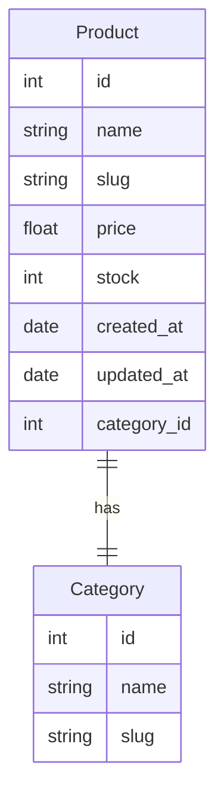

# XYZ

## TDD

[melhorar]
Feito utilizando metodologia TDD `test driven development` para robustez e 
manutenibilidade a longo prazo atraves da seguranca ao refatorar.

## UML

```mermaid
erDiagram
    Category {
        int id
        string name
        string slug
    }

    Product {
        int id
        string name
        string slug
        float price
        int stock
        date created_at 
        date updated_at
        int category_id
    }

    Product ||--|| Category : has
```

